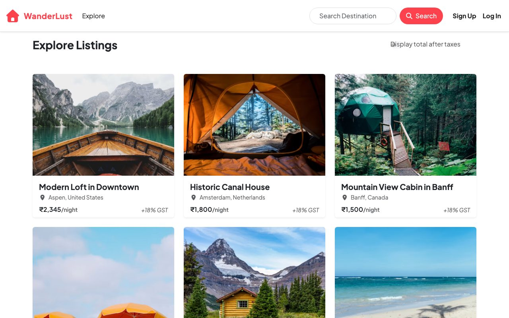

# Project Air

A WanderLust-style listing site for sharing places to stay around the world — discover places, browse photos, and leave reviews.

[](https://wandera-bncl.onrender.com)

**Live Demo:** https://wandera-bncl.onrender.com

Built with Node.js + Express + EJS + MongoDB, with Passport auth, Cloudinary uploads, and Google Maps.

## About

Users can browse and search property listings, view a map of each place, and sign up to create their own listings or leave reviews. Owners of a listing can edit or delete it; review authors can delete their own reviews. All authorization is enforced server-side.

## Features

- User signup / login / logout
- Property listings with photos
- Search by title, location, or country
- Create, edit, and delete your own listings
- Image uploads (Cloudinary)
- Star-rated reviews
- Google Maps on listing pages
- Owner-only edit/delete, author-only review delete
- Responsive Bootstrap UI

## Tech Stack

- **Backend:** Node.js, Express 5
- **Database:** MongoDB via Mongoose
- **Templating:** EJS + ejs-mate
- **Auth:** Passport (local), express-session with MongoStore
- **Uploads:** Multer → Cloudinary
- **Validation:** Joi
- **Maps:** Google Maps JavaScript API
- **Security:** Helmet, express-rate-limit
- **Frontend:** Bootstrap 5, vanilla JS, custom CSS

## How it works

A classic server-rendered MVC app. Express routes in `routes/` hand off to controllers in `controllers/`, which talk to Mongoose models and render EJS views. For example, `GET /listings/:id` loads the listing (with reviews and owner) and renders `views/listings/show.ejs`, which includes a Google Map.

```
GET /listings/:id
  → routes/listing.js
  → controllers/listings.js → showListing()
  → Listing.findById(...).populate("reviews").populate("owner")
  → views/listings/show.ejs
```

## Run locally

```bash
npm install
cp .env.example .env   # add your values
npm start              # or: npm run dev (nodemon)
```

Requires Node.js 20+ and a MongoDB instance (local `mongod` or Atlas). Starts on `http://localhost:8080`.

Optional seed data (local dev only, refuses to run in production):

```bash
node init/index.js
```

## Environment Variables

Copy `.env.example` to `.env` and fill in the values. Never commit `.env`.

| Variable | Required | Notes |
| -------- | -------- | ----- |
| `ATLASTDB_URL` | Yes | MongoDB connection string |
| `SECRET` | Yes | Session secret |
| `CLOUD_NAME` | Yes* | Cloudinary cloud name |
| `CLOUD_API_KEY` | Yes* | Cloudinary API key |
| `CLOUD_API_SECRET_KEY` | Yes* | Cloudinary API secret |
| `GOOGLE_MAPS_API_KEY` | No | Enables embedded maps |
| `PORT` | No | Defaults to 8080 |

*Required for image uploads; the app still starts without them.

## Deployment

Deployed on Render (see `render.yaml`) with MongoDB Atlas and Cloudinary. On Render, set the env vars above (never in `render.yaml`), set `NODE_ENV=production`, and Render injects `PORT`.

- Build command: `npm install`
- Start command: `npm start`
- Health check: `/listings`
- `GET /health` returns `{"status":"ok"}` for uptime monitors (no DB calls)

Security notes: HTTPS-only session cookies in production, Helmet headers, rate limiting on global and auth routes.

## Known limitations

- No CSRF tokens (mitigated with SameSite=Lax cookies and POST-only mutations).
- CSP is disabled because views use inline scripts/styles.
- Seeded sample listings use Unsplash images, not Cloudinary; only user uploads are cleaned up on delete.